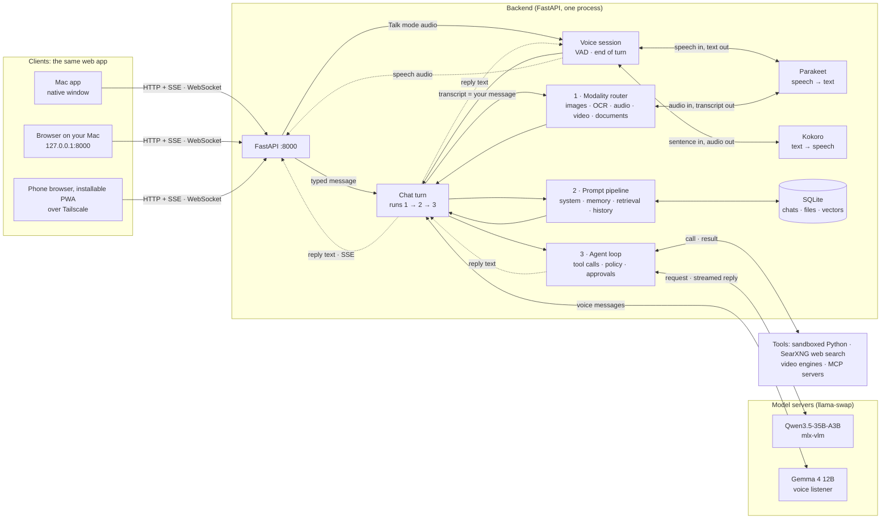

# Architecture

Solid arrows are requests and `<-->` is a call that returns its result. The **chat turn** runs every message, typed or spoken, through the same three steps in order, and each step hands its result back to it.

**A message's path:**
1. The **modality router** turns attachments into model-ready content. Photos are resized and stripped of metadata. Screenshots get OCR text as well. Audio is transcribed with timestamps. Video becomes key frames plus a transcript. Documents become text or retrieval chunks.
2. The **prompt pipeline** assembles the prompt with stable parts first, so the model server's prefix cache is reused: the system prompt, tools and style, then memories, retrieved passages and the recent history, fitted to the context budget.
3. The **agent loop** streams the model's reply to the client over Server-Sent Events. When the model calls a tool, the **policy** decides allow, ask or deny. The result goes back to the model wrapped as untrusted data, and the loop continues.
4. Everything is stored in **SQLite**: messages form a tree for edits and branches, with full-text and vector search.

**Models** run behind [llama-swap](https://github.com/mostlygeek/llama-swap), which starts [mlx-vlm](https://github.com/Blaizzy/mlx-vlm) servers on demand and keeps the chat model and the voice listener loaded together. Speech, embeddings and reranking run in-process and unload when idle. Video engines run as separate processes in their own environment, so their memory is fully released after each render. A **memory budget** (set by the installer to 70% of your Mac's memory) decides what can be loaded at once.

**Voice mode** streams 16 kHz audio over a WebSocket. Voice activity detection and a turn-taking model decide when you've finished speaking. Parakeet turns your speech into text, and that text becomes your message: it goes through the same chat turn as a typed one. The reply text comes back to the voice session, and Kokoro speaks it sentence by sentence as it's written; that audio goes only to your device, never to the model. Speaking over the reply cancels it within about 0.4 seconds. Recorded voice messages are different: Gemma listens to the audio itself and adds a note on what you said and how.

**Security:**
- The backend accepts only loopback requests unless remote access is on.
- The code tool runs in a macOS sandbox with no network, writing only to its own folder.
- Web fetching blocks private and local addresses.
- Artifacts run in a sandboxed frame with no network access, no same-origin access and a strict content security policy.
