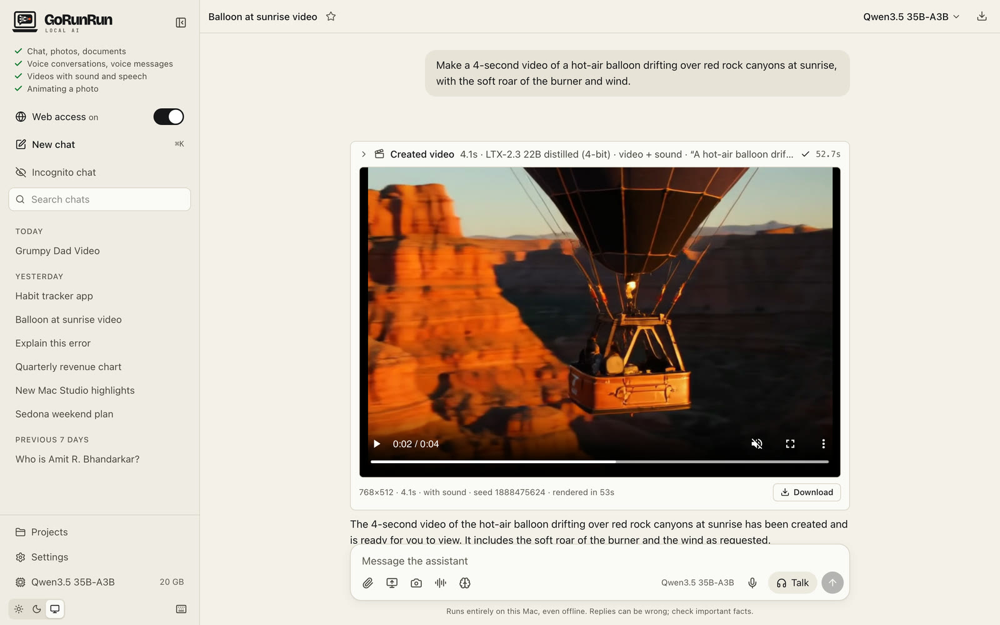
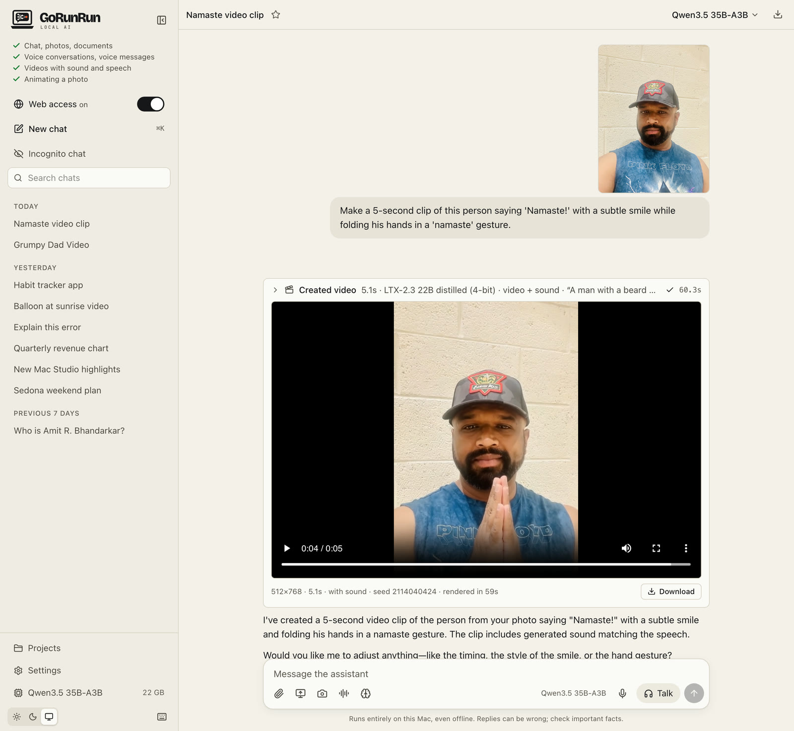
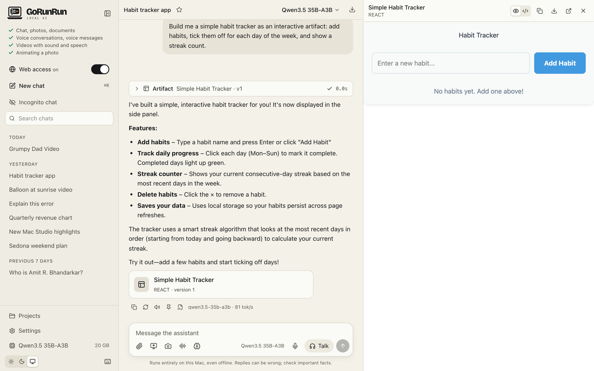

# Videos and mini apps
{: .no_toc }

1. TOC
{:toc}

## Create a video

Describe what you want to see and hear:

> Make a 4-second video of a hot-air balloon drifting over red rock canyons at sunrise, with the soft roar of the burner and wind.

The assistant writes a detailed description and asks you to approve the render. Rendering happens on your Mac, and a progress bar shows how it's going. The finished clip plays in the chat, with a **Download** button.

{: .screenshot }

Video creation needs a Mac with 64 GB of memory. The installer includes it by default with LTX-2.3, and lets you add Wan 2.2, choose Wan 2.2 only, or skip video. If you skipped it, run the installer again to add it (see [Install](../install)). The two engines:

| | LTX-2.3 (default) | Wan 2.2 |
|---|---|---|
| Sound | Yes: effects, ambience and speech | No |
| Length | up to 10 seconds | up to 5 seconds |
| Time for 4 seconds of video | about 1 minute | about 6–7 minutes |

With both installed, LTX-2.3 is used unless you say "use Wan 2.2".

### Bring a photo to life

Attach a photo and describe what should happen:

> Make a 5-second clip of this person saying 'Namaste!' with a subtle smile while folding his hands in a 'namaste' gesture.

{: .screenshot }

The photo becomes the first frame and the clip keeps its shape (portrait or landscape). With LTX-2.3 the person can speak; the mouth movement follows the words closely, but not perfectly.

{: .warning }
Only animate photos of people who agree to it, and don't use it to put words in real people's mouths to mislead anyone.

## Mini apps, charts and documents

Ask for something you'd use on its own (a chart, a calculator, a small game, a diagram, a long document) and it opens in a side panel next to the chat:

> Build me a simple habit tracker: add habits, tick them off for each day of the week, and show a streak count.

{: .screenshot }

In the panel you can switch between the preview and the code, go back to earlier versions, copy, download, or open it in its own tab. Ask for changes in the chat and a new version appears.

These mini apps run in a sealed-off frame: they can't see your chats, your files or the internet.
