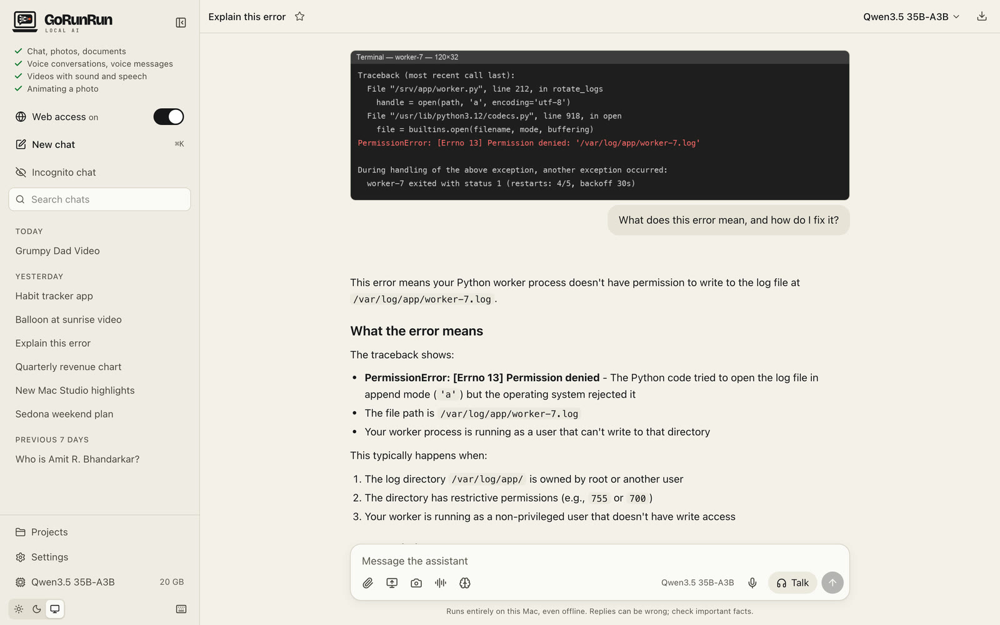

# Photos, files and media

Attach things with the **paperclip**, by dragging them into the window, or by pasting with **⌘V**. You can attach several at once.

| What | What it can do |
|---|---|
| **Photos** (JPEG, PNG, HEIC, WebP) | Describe them, read text in them, answer questions about them. Location data is removed first. |
| **Screenshots** | Explain an error, summarize a page, read a chart. Use the screen button to capture a window or area without leaving the app. |
| **Documents** (PDF, Word, Excel, PowerPoint, text, code) | Summarize, answer questions and quote the page. Long documents are searched for the relevant parts. |
| **Voice messages** | Record with the waveform button. It hears your words and your tone of voice. |
| **Audio** (m4a, mp3, wav…) | Transcribes it with timestamps, then answers questions. |
| **Video** (mp4, mov, screen recordings) | Looks at key moments and listens to the soundtrack, then answers questions like "what happens at 1:20?". |
| **Camera** | Take a photo or a short clip with the camera button. |

{: .screenshot }

Everything is processed on your Mac. Nothing is uploaded anywhere.
