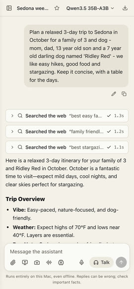

# Use it from your phone

Your phone can use the assistant running on your Mac, even away from home, through [Tailscale](https://tailscale.com), a free private network between your own devices. Nothing is exposed to the public internet, and a login token protects access.

In the app, open **Settings → Phone access**. It walks you through three steps, and each one ticks itself when it's done:

1. **Set up Tailscale on your Mac.** Click **Download Tailscale for Mac**, open it, and sign in from its menu-bar icon (Google, Apple, Microsoft or GitHub; free for personal use).
2. **Set up Tailscale on your phone.** Scan the QR code for the App Store (iPhone) or Google Play (Android), install Tailscale, and sign in with the same account. Allow the VPN configuration when asked. The step ticks once your phone shows up on your Tailscale network.
3. **Use it from your phone.** Turn on **Allow access from my phone**, then point your phone's camera at the QR code and tap the link: it opens signed in, with no token to type. Or send yourself the sign-in link with **Share** (AirDrop, Messages or Mail) or **Copy link**. Add it to your home screen to use it like an app.

The link looks like `https://my-mac.tail1234.ts.net/#token=…`. The part after `#` stays on your phone: it isn't sent over the network or saved in any log. If you'd rather type it, the same screen shows the address and the login token separately.

Turn the switch off to stop phone access. Phone access also turns off while **Web access** is off; if that's what turned it off, it comes back on by itself when you turn Web access on. **New token** signs out every device and makes old links stop working.

{: .warning }
> **Sharing with family or friends?** Anyone with the link can use your assistant and see all your chats, memories and files, just as you can. They also need to be on your Tailscale network: invite them, or share this Mac with them from the [Tailscale admin console](https://login.tailscale.com/admin/machines). To take access back, make a new token.

{: .screenshot .phone }

The Mac must be on, awake and running GoRunRun Local AI. Turn on **Keep Running in Background** in the app's menu so it stays available after you close the window.
