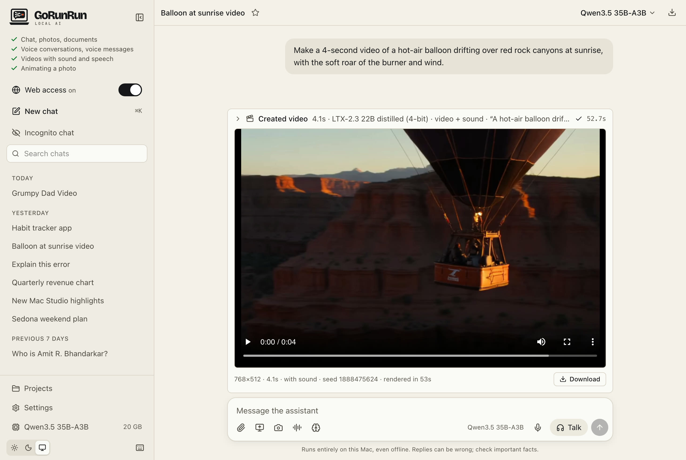
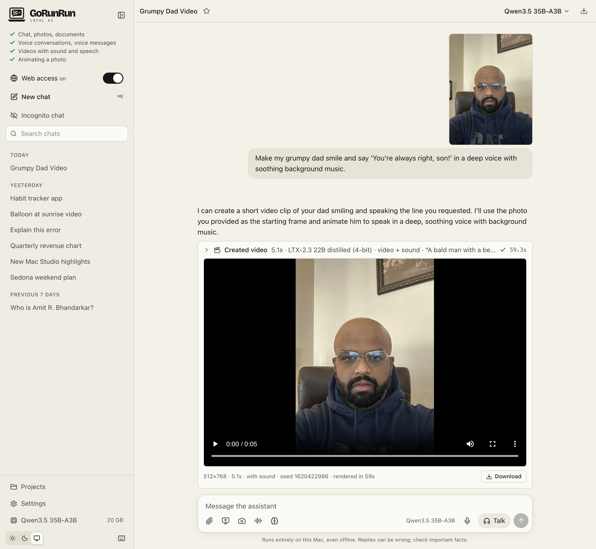

# Your own AI assistant, running on your Mac
{: .fs-9 .mb-2 }

<svg aria-hidden="true" width="1em" height="1em" viewBox="0 0 24 24" fill="none" stroke="currentColor" stroke-width="2.5" stroke-linecap="round" stroke-linejoin="round"><path d="M12 20h.01"/><path d="M8.5 16.43a5 5 0 0 1 7 0"/><path d="M5 12.86a10 10 0 0 1 5.17-2.69"/><path d="M19 12.86a10 10 0 0 0-2-1.39"/><path d="M2 8.82a15 15 0 0 1 4.18-2.65"/><path d="M22 8.82a15 15 0 0 0-11.29-3.76"/><path d="m2 2 20 20"/></svg>Works completely offline

<strong>Completely free.</strong> No subscriptions and no usage limits: the only limit is your own Mac's hardware.

<strong>Completely private.</strong> Your chats, photos, voice and files stay on your Mac: no account, no tracking, no AI company in the middle. If you choose to enable web access, only your search words go out, and only when you use web search.

GoRunRun Local AI works like the AI chat apps you know, but everything happens on your computer. Once it's installed, it doesn't even need the internet.
{: .hero-lead }

[Install on your Mac](install){: .btn .btn-primary .fs-5 .mb-4 .mb-md-0 .mr-2 }
[View on GitHub](https://github.com/gorunrunai/local-ai){: .btn .fs-5 .mb-4 .mb-md-0 }

<section class="offline-band" markdown="0">
  
<svg aria-hidden="true" width="18" height="18" viewBox="0 0 24 24" fill="none" stroke="currentColor" stroke-width="2" stroke-linecap="round" stroke-linejoin="round"><path d="M12 20h.01"/><path d="M8.5 16.43a5 5 0 0 1 7 0"/><path d="M5 12.86a10 10 0 0 1 5.17-2.69"/><path d="M19 12.86a10 10 0 0 0-2-1.39"/><path d="M2 8.82a15 15 0 0 1 4.18-2.65"/><path d="M22 8.82a15 15 0 0 0-11.29-3.76"/><path d="m2 2 20 20"/></svg> No internet needed

  <h2>Switch off the Wi-Fi. It keeps working.</h2>
  
After you install it, GoRunRun Local AI runs on your Mac's own chip, with no connection at all. Use it on a plane, in a cabin, or on a network you don't trust.

  

    

      <h3>Works offline</h3>
      <ul>
        <li>Chatting, writing and coding help</li>
        <li>Photos, screenshots, PDFs and documents</li>
        <li>Voice conversations and voice messages</li>
        <li>Creating videos, with sound</li>
        <li>Charts and little apps it builds for you</li>
        <li>Your saved chats, projects and memory</li>
      </ul>
    

    

      <h3>Needs the internet</h3>
      <ul>
        <li>Installing and updating</li>
        <li>Web search and reading web pages, only when you ask</li>
        <li>Using it from your phone when you're away from the Mac</li>
      </ul>
    

  

</section>

## What you can do

  
<h3>Chat about anything</h3>
Ask questions, plan trips, draft emails, write and explain code. Answers stream in as they're written.

  
<h3>Share photos and files</h3>
Drop in photos, screenshots, PDFs, Word and Excel files, audio or video, and ask about them.

  
<h3>Talk out loud</h3>
Have a spoken conversation and interrupt it any time, like talking to a person. It replies in under a second.

  
<h3>Create videos</h3>
Describe a scene and get a short video with sound, or bring one of your photos to life.

  
<h3>Build little apps</h3>
Ask for a chart, a calculator or a tracker and use it right there in a side panel.

  
<h3>Search the web when you want</h3>
Turn on web search for current events; answers show which pages they came from.

## Private by design

- **It runs on your Mac.** The AI models are downloaded once and then run on your Mac's own chip. Your chats, files and voice never leave the computer.
- **No account, no tracking.** There's nothing to sign up for, and the app sends no usage data anywhere.
- **Your choice when to go online.** The internet is used only to download the models, and when you ask it to search or open a web page.
- **Incognito chats** are never saved and never used for memory.

## Everyday questions

Plan a trip, draft an email, compare options or explain something new. Answers arrive in seconds, formatted with tables and lists when that helps.

{: .screenshot }

*"Plan a relaxed 3-day trip to Sedona in October for a family of 3 and dog - mom, dad, 13 year old son and a 7 year old darling dog named 'Ridley Red' - we like easy hikes, good food and stargazing. Keep it concise, with a table for the days." Answered on a MacBook Pro in about 15 seconds, including three quick web searches.*

## See it make a video

<figure class="app-window" markdown="0">
  
<em>GoRunRun Local AI</em>

  

    
    <video class="app-shot-video" src="assets/video/balloon-sunrise.mp4" poster="assets/video/balloon-sunrise.jpg" controls playsinline preload="metadata"
      style="left: 34.141%; top: 27.849%; width: 54.219%; height: 52.093%" aria-label="The generated balloon video, with sound"></video>
  

</figure>

*"Make a 4-second video of a hot-air balloon drifting over red rock canyons at sunrise, with the soft roar of the burner and wind." Created on a MacBook Pro in 53 seconds, with sound.*

## Animate your photos

Attach a photo and say what should happen. The people in it can move, smile and speak, with sound, all made on your Mac.

<figure class="app-window" markdown="0">
  
<em>GoRunRun Local AI</em>

  

    
    <video class="app-shot-video" src="assets/video/dad-smiles.mp4" poster="assets/video/dad-smiles.jpg" controls playsinline preload="metadata"
      style="left: 34.141%; top: 47.055%; width: 54.219%; height: 37.966%" aria-label="The dad from the photo smiles and says: You're always right, son! (with sound)"></video>
  

</figure>

*"Make my grumpy dad smile and say 'You're always right, son!' in a deep voice with soothing background music." Made from one photo on a MacBook Pro in 59 seconds, with sound.*

## Voice conversations

Talk to it out loud and interrupt any time, like talking to a person. It usually starts answering within a second, and it all happens on your Mac.

<video class="screenshot loop-anim" src="assets/video/talk-mode.mp4" poster="assets/video/talk-mode.jpg" autoplay loop muted playsinline
  aria-label="Talk mode: the lava lamp glows blue while listening, turns rose while thinking and orange while the assistant answers out loud"></video>

*The lamp is blue while it listens, rose while it thinks and orange while it talks.*

## What you need

- A Mac with Apple silicon (M1 or newer) and **32 GB of memory or more** (64 GB for the default model and everything else; [see what each Mac gets](macs))
- macOS 15 or newer
- About **20–40 GB of free space** for the AI models, depending on the one you choose (55 GB more for video creation)

Windows and Linux support is planned.

[Install it now](install), or [browse the screenshots](screenshots).

## Open source

GoRunRun Local AI is free and open source under the Apache 2.0 license. You can read every line, change it, and add your own tools and models. [Start here if you're a developer](developers).
