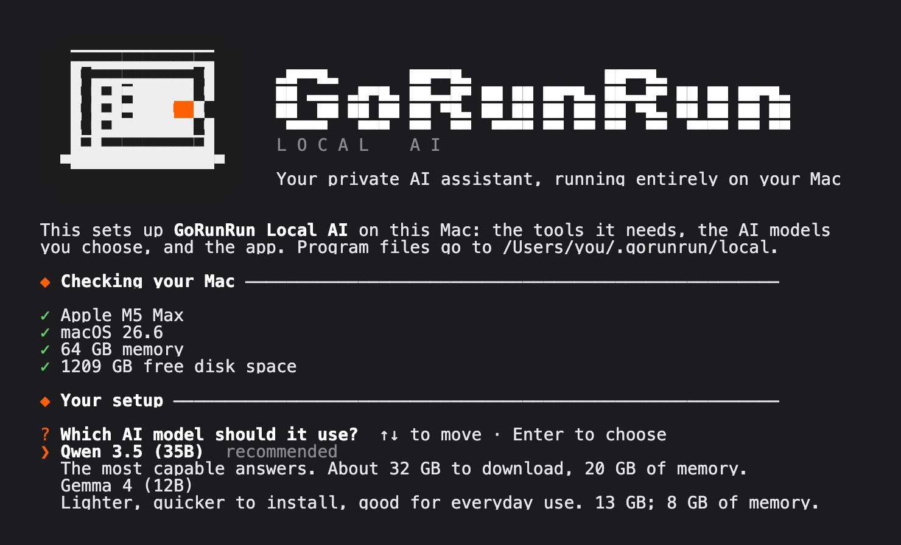
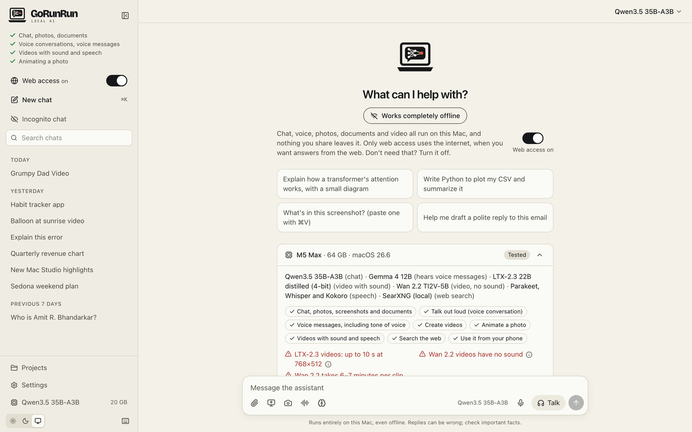

# Install GoRunRun Local AI
{: .no_toc }

Installing takes one command and about an hour, most of it spent downloading the AI models. You don't need to know how to code.
{: .fs-6 .fw-300 }

1. TOC
{:toc}

## Before you start

Check that your Mac has what it needs. Choose **Apple menu > About This Mac**:

| You need | Where to look |
|---|---|
| **Chip:** Apple M1 or newer | "Chip" |
| **Memory:** 32 GB or more (64 GB for the default model; 48 GB for video creation). [What you get with each size](macs) | "Memory" |
| **macOS 15** or newer | "macOS" |
| **Free space:** about 40 GB (20 GB with the lighter model; 55 GB more for video creation) | Apple menu > System Settings > General > Storage |

Plug in your Mac and connect to a fast network: the download is 13–32 GB, depending on the model you choose.

## Step 1: Open Terminal

Terminal is an app that comes with every Mac. Press **⌘ Space**, type **Terminal**, and press **Return**. A window with a blinking cursor opens.

## Step 2: Paste the install command

Copy this line, paste it into Terminal with **⌘ V**, and press **Return**:

```sh
curl -fsSL https://raw.githubusercontent.com/gorunrunai/local-ai/main/install.sh | bash
```
{: .install }

The installer opens in its own screen, checks your Mac, then asks two questions. When it closes, your Terminal window is back as it was, with a short summary. Choose with the **arrow keys** and press **Return**, or type an option's number.

{: .screenshot }

The two questions:

1. **Which AI model to use.** Press **Return** for **Qwen 3.5**, the most capable (about 32 GB to download; it needs 64 GB of memory). Or type **2** for **Gemma 4**, which is lighter and quicker to install (about 13 GB) and still good for everyday use. On Macs with less than 64 GB of memory, Gemma is chosen for you and Qwen isn't offered. [See what each Mac gets](macs).
2. **Video creation.** It lets GoRunRun Local AI make short videos and bring your photos to life. It's included by default on Macs with 64 GB of memory or more (on 48 GB Macs, LTX-2.3 is offered but off by default, and Wan 2.2 isn't offered), so just press **Return** to keep the recommended engine, or pick another:
   - **LTX-2.3** (the default): videos with matching sound and speech, about a minute per clip. About 28 GB.
   - **LTX-2.3 and Wan 2.2**: also adds Wan, which gives sharper video without sound and takes 6–7 minutes per clip. About 52 GB in total.
   - **Wan 2.2 only**: sharp video with **no sound at all**: no speech, music or sound effects, and photos can't be made to talk. The installer asks you to confirm. About 24 GB.
   - **No video creation**: skip it for now. Run the installer again to add it later.

{: .note }
> Don't want video creation? This command skips it without asking:
> ```sh
> curl -fsSL https://raw.githubusercontent.com/gorunrunai/local-ai/main/install.sh | bash -s -- --without-video
> ```

{: .tip }
> Want to see exactly what it will do first? This version asks the same questions, then lists what it would install and download, and changes nothing:
> ```sh
> curl -fsSL https://raw.githubusercontent.com/gorunrunai/local-ai/main/install.sh | bash -s -- --dry-run
> ```
> Add `--machine=M4Max-48GB` (any chip and memory) to preview the setup for a different Mac. [Help us test Mac sizes we haven't tried](macs#help-us-test).

## Step 3: Let it work

After a last review of what it will install (confirm with **Return**), the installer:

1. **Checks your Mac** and stops with a clear message if something is missing.
2. **Installs the tools it needs.** If your Mac doesn't have Apple's command line tools, a window asks to install them: click **Install**. If it asks for your Mac password, type it and press Return (the letters won't show while you type).
3. **Downloads the AI models.** This is the long part, usually 30–60 minutes.
4. **Adds GoRunRun Local AI to your Applications folder** and opens it.

You can keep using your Mac while it runs. If the download is interrupted, run the same command again: it continues where it stopped.

## Step 4: Start chatting

GoRunRun Local AI opens by itself when the install finishes. Later, open it from your **Applications** folder or with Spotlight (**⌘ Space**, type "GoRunRun").

The first start takes up to a minute while the AI model loads. After that, replies begin in well under a second.

{: .tip }
From now on GoRunRun Local AI doesn't need the internet. Try it: turn off Wi-Fi and keep chatting. Only web search waits until you're back online.

{: .screenshot }

When you first use the microphone or camera, macOS asks for permission: click **Allow**. Your voice and images stay on your Mac.

{: .tip }
While the app is open you can also use GoRunRun Local AI in any browser at [http://127.0.0.1:8000](http://127.0.0.1:8000). That address only works on your own Mac.

## Updating

Run the install command again. It downloads the latest version and keeps your chats and settings.

## Uninstalling

Paste this into Terminal:

```sh
curl -fsSL https://raw.githubusercontent.com/gorunrunai/local-ai/main/install.sh | bash -s -- --uninstall
```

It removes the app and asks before deleting your chats. The AI models stay in a shared folder (`~/.cache/huggingface`) that other AI apps also use. Delete that folder to free the space if nothing else needs it.

## If something goes wrong

- **"At least 32 GB of memory is required"** or **"An Apple Silicon Mac is required"**: this Mac can't run the AI models yet.
- **The download stops or fails:** check your internet connection and run the install command again.
- **The app says "didn't start":** choose **Help > Show Logs** in the app and open `backend.log`, then [ask for help on GitHub](https://github.com/gorunrunai/local-ai/issues) and include the last lines of that file.

See the [FAQ](faq) for more.
