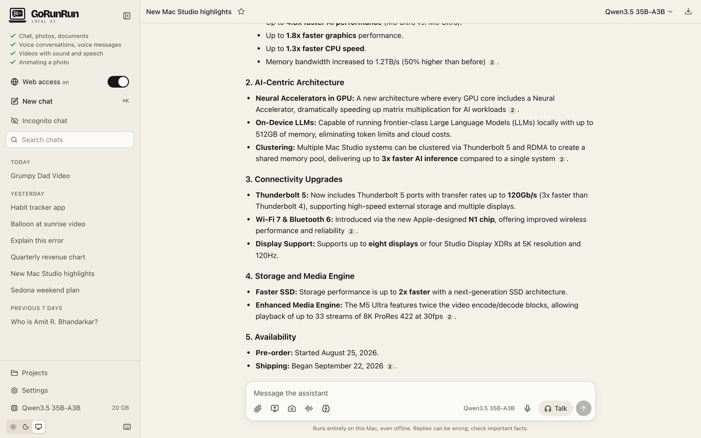
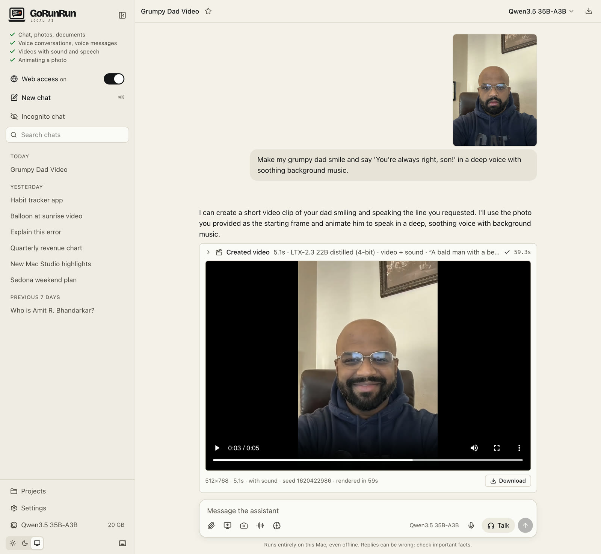
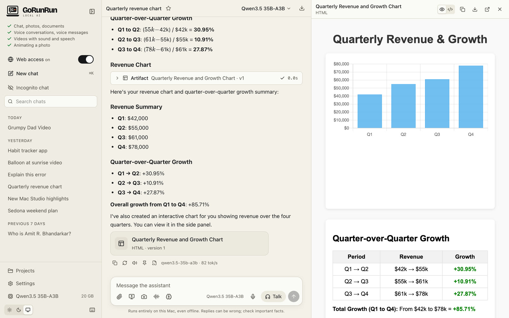
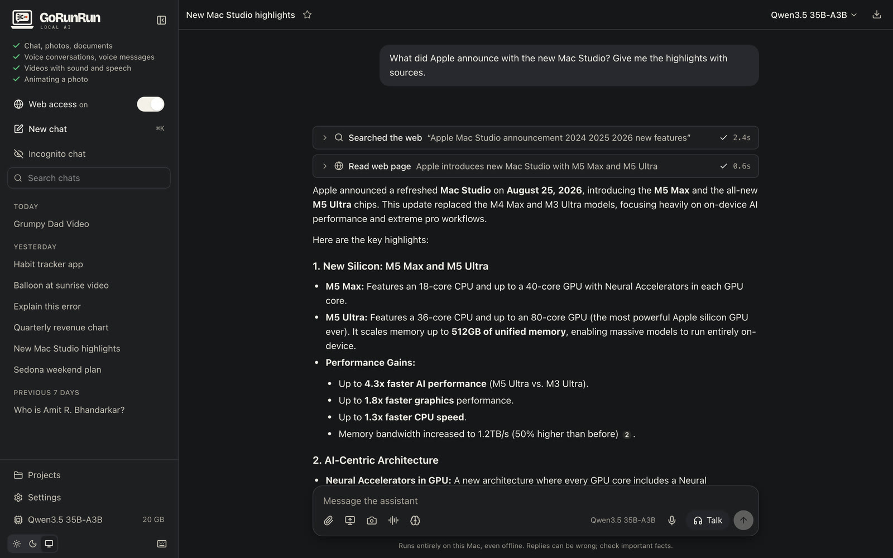
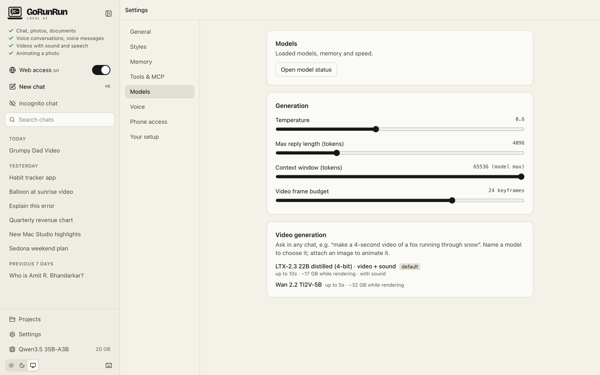

# Screenshots

All screenshots are from GoRunRun Local AI running on a MacBook Pro, with nothing sent to the cloud.

### Answers with sources from the web
{: .screenshot }

### Everyday questions
{: .screenshot }

### Screenshots and photos
{: .screenshot }

### Videos with sound
{: .screenshot }

### Fun with photo animation
{: .screenshot }

### Mini apps
{: .screenshot }

### Charts
{: .screenshot }

### Voice conversations
<video class="screenshot loop-anim" src="assets/video/talk-mode.mp4" poster="assets/video/talk-mode.jpg" autoplay loop muted playsinline
  aria-label="Talk mode: the lava lamp glows blue while listening, turns rose while thinking and orange while the assistant answers out loud"></video>

The lamp is blue while it listens, rose while it thinks and orange while it talks.

### Dark mode
{: .screenshot }

### Settings
{: .screenshot }

### On your phone
{: .screenshot .phone }
